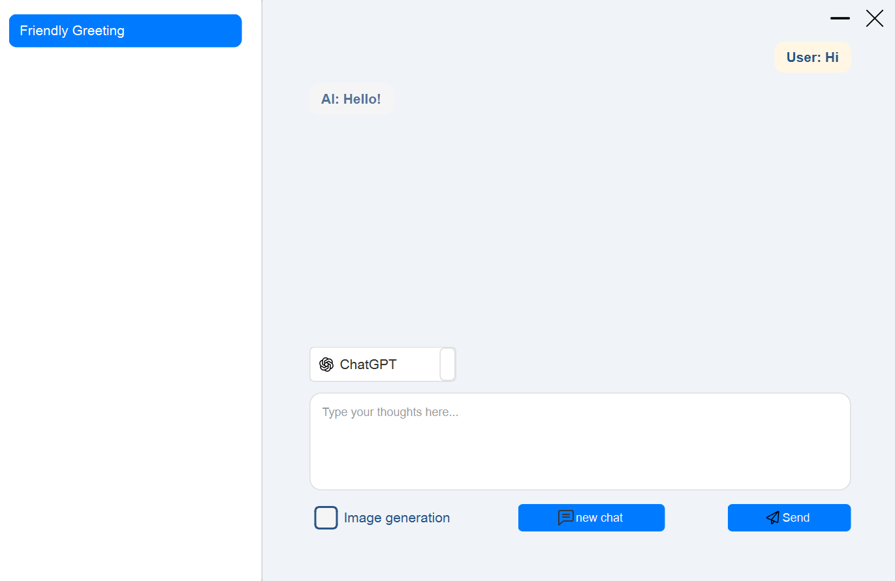
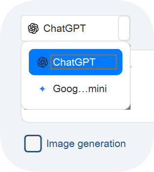
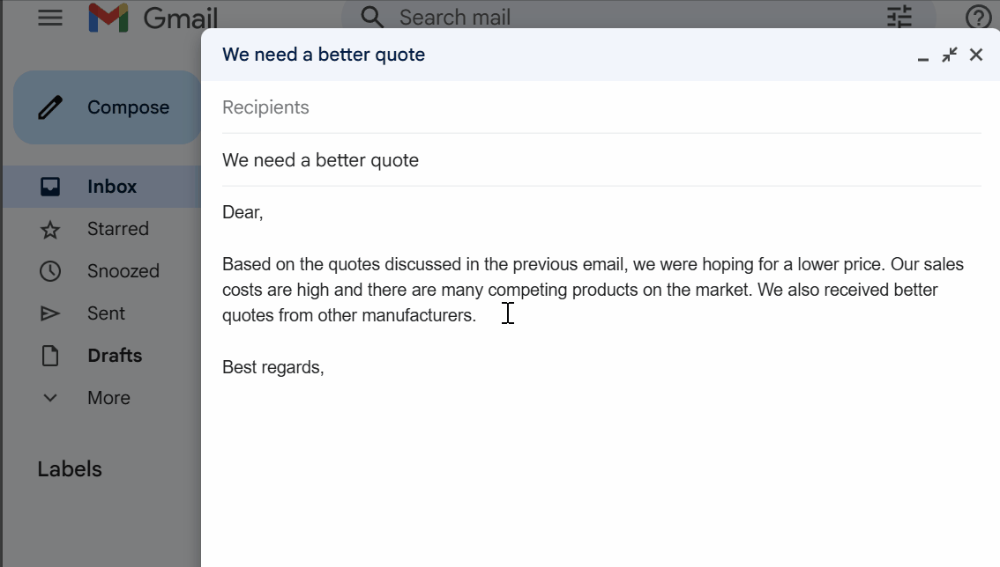

# AI Desktop Tool Project Documentation

## 1. Project Overview
This document provides a detailed overview of the desktop AI tool developed using Qt. The tool currently focuses on text-based AI interactions, offering conversation management, context-aware responses, and text rewriting functionalities. The project aims to evolve into a fully functional MVP (Minimal Viable Product), with future plans to include clipboard integration for smart suggestions, image generation, and a more refined user interface.

## 2. Core Features Showcase
This section will showcase the main features of the AI desktop tool and an overview of the user interface.

### 2.1. Main Interface Overview and AI Model Selection
The application provides a simple and intuitive main interface where users can engage in conversations and view AI responses. Importantly, users can easily select different AI models (currently supporting GPT and Gemini) to experience various dialogue styles and capabilities.



### 2.2. AI Dialogue Effect Demonstration
Both the GPT and Gemini models can provide coherent and relevant responses based on context, significantly enhancing the user interaction experience.



### 2.3. Text Rewriting Feature Demonstration
The tool offers a powerful text rewriting feature, allowing users to input text and provide rewriting instructions. The AI will adjust the text style, tone, or content based on the request. This is highly useful for daily communication and content creation.

**Use case:**
The user inputs a piece of text and specifies requirements like “make it more casual” or “make it more formal,” and the AI will instantly generate a rewritten version that fits the request.



## 3. Technical Architecture

The application follows a clear separation of responsibilities and utilizes the following key components:

### AIClient (Abstract Base Class)
Defines the common interface for interacting with AI services, including methods for setting API keys, sending messages, requesting conversation titles, sending rewrite requests, and requesting image generation. It also defines signals for receiving AI responses, errors, and generated titles/rewrite content/image data.

### GeminiClient (Specific AI Implementation)
Inherits from `AIClient` and implements the interaction logic with the Google Gemini API. It handles API key storage, constructs JSON requests (including conversation history for context), manages different request types (chat, title generation, rewriting, image generation), and processes AI responses.

#### Extensibility Design: Unified Network Response Handling
To efficiently and flexibly handle different types of AI requests (such as chat, title generation, rewriting, image generation), `GeminiClient` adopts the following core design patterns:
- **Enum (enum class RequestType):** Defines an enumeration that clearly identifies the type of each request (ChatMessage, TitleGeneration, Rewrite, ImageGeneration). This helps tag each request when sending it.

  ```cpp
  enum class RequestType {
      ChatMessage,      // Chat message request
      TitleGeneration,  // Title generation request
      Rewrite,          // Rewrite request
      ImageGeneration   // Image generation request
  };
  ```

- **QMap<QNetworkReply*, RequestType> requestTypeMap:** Since network requests are asynchronous, when `QNetworkAccessManager` completes a request and emits the `finished` signal, it only returns a `QNetworkReply*` pointer. To identify the type of request corresponding to this reply, `GeminiClient` uses a `QMap` to store the mapping between `QNetworkReply*` and its corresponding `RequestType`. When sending a request, the reply pointer and request type are stored in this map.

- **Unified Slot Function (onNetworkReplyFinished):** All `finished` signals from `QNetworkAccessManager` are connected to the `GeminiClient::onNetworkReplyFinished` slot function. When any network reply is received, this function performs the following operations:
  1. Looks up the corresponding `RequestType` for the current `QNetworkReply*` from `requestTypeMap`.
  2. Based on the obtained `RequestType`, parses different JSON response structures (e.g., text responses have a `candidates` field, image responses have a `predictions` field).
  3. Based on the parsed result and request type, emits corresponding signals (such as `aiResponseReceived()`, `titleGenerated()`, `rewritedContentReceived()`, or `imageGenerated()`) to pass the processed data to the `MainWindow`.
  4. After processing, removes the entry for this reply from `requestTypeMap` and safely deletes the `QNetworkReply` object.

This design pattern greatly enhances the scalability and maintainability of the code. When new AI request types need to be added, simply add a new item in the `RequestType` enum and extend the parsing and signal-emitting logic in `onNetworkReplyFinished`, without needing to create new network request handling functions.

### GPTClient (Specific AI Implementation)
Similar to `GeminiClient`, used to implement the interaction logic with the OpenAI GPT API.

### MainWindow (UI and Application Logic)
Manages the main application window, UI elements, and overall application flow. It is responsible for:
- Setting up UI elements (e.g., chat history list, text display area).
- Initializing and connecting signals/slots to different AI clients.
- Loading and saving chat history to local JSON files.
- Displaying user and AI messages (including images) in the chat interface.
- Handling user input and triggering AI requests.
- Updating the UI based on AI responses and managing the conversation state.

### Qt Framework
Used to build the cross-platform desktop application, providing powerful UI, networking, and data handling capabilities.


## 4. Local JSON Structure (chathistory.json)
The application stores all conversation history in a JSON file named `chathistory.json`. Its structure is as follows:

```json
{
  "conversations": [
    {
      "title": "Conversation Title 1",
      "dialogue": [
        {
          "user": "User Message 1",
          "ai": "AI Response 1"
        },
        {
          "user": "User Message 2",
          "ai": "AI Response 2"
        }
      ]
    },
    {
      "title": "Conversation Title 2",
      "dialogue": [
        {
          "user": "User Message A",
          "ai": "AI Response A"
        }
      ]
    }
  ]
}
```

- **conversations:** A JSON array containing all individual conversations.
- Each conversation is an object containing:
  - **title:** The string title of the conversation.
  - **dialogue:** A JSON array containing the conversation turns.
- Each conversation turn is an object containing:
  - **user:** The string message from the user.
  - **ai:** The string response from the AI.

## 5. API Requests and Response Structures
This section shows examples of the JSON structures used when communicating with the AI models.

### 5.1. Text Message Request (sendMessage)
Used to send a user message and retrieve the AI response. The `contents` array includes the entire conversation history to provide context.

```json
{
  "contents": [
    {
      "role": "user",
      "parts": [
        {
          "text": "User Historical Message 1"
        }
      ]
    },
    {
      "role": "model",
      "parts": [
        {
          "text": "AI Historical Response 1"
        }
      ]
    },
    {
      "role": "user",
      "parts": [
        {
          "text": "Current User Input"
        }
      ]
    }
  ],
  "generationConfig": {
    "temperature": 0.3 // Optional, used to control the randomness of generated text
  }
}
```

### 5.2. Image Generation Request (requestImageGeneration)
Used to request AI to generate an image. The `instances` array contains the image description.

```json
{
  "instances": [
    {
      "prompt": "Image description, e.g., a cat chasing a butterfly on the grass"
    }
  ],
  "parameters": {
    "sampleCount": 1 // Number of images to generate
  }
}
```

### 5.3. API Response Format
API responses typically contain the generated AI text or Base64-encoded image data.

Text Response Example:
```json
{
  "candidates": [
    {
      "content": {
        "role": "model",
        "parts": [
          {
            "text": "This is the AI-generated response text"
          }
        ]
      },
      "finishReason": "STOP",
      "index": 0
    }
  ]
}
```

Image Response Example:
```json
{
  "predictions": [
    {
      "bytesBase64Encoded": "Base64 encoded image data string"
    }
  ]
}
```

## 6. Usage Instructions

### 6.1. Development Environment
- **Qt Version:** 6.9.1
- **Compiler:** MSVC x64
- **Build System:** CMake

### 6.2. How to Open and Build the Project
1. Install Qt 6.9.1: Ensure that you have Qt 6.9.1 and the MSVC x64 compiler components installed.
2. Open the Project:
   - Open Qt Creator.
   - Select "Open Project."
   - Navigate to your project directory and select the `CMakeLists.txt` file.
3. Configure CMake:
   - After opening the project in Qt Creator, make sure the following line is enabled in the `CMakeLists.txt` file to display the application icon correctly:
     ```cmake
     set(CMAKE_AUTO_RCC ON)
     ```
   - Qt Creator should automatically configure the build. If needed, manually run CMake.
4. Build the Project:
   - In Qt Creator, click the "Build" menu -> "Build Project" (usually Ctrl+B).

### 6.3. API Key Configuration
For security reasons, API keys should not be hard-coded into the application. This application uses an INI format configuration file to store the API key.

1. Create the `config.ini` file:
   - In your project build output directory (e.g., `build-YourProjectName-Desktop_Qt_6_x_x_MSVC_64_bit-Debug` or `Release` folder), create a text file named `config.ini`.
   - Open `config.ini` with a text editor and add the following content:
     ```ini
     [API]
     GeminiKey=YOUR_ACTUAL_GEMINI_API_KEY_HERE
     GPTKey=YOUR_ACTUAL_GPT_API_KEY_HERE
     ```
2. In the application, during startup, `MainWindow::GeminiSetup()` and `MainWindow::GPTSetup()` (assuming you have similar GPT setup functions) will use `QSettings` to read these keys from `config.ini`. If the keys are empty or still placeholders, the application will display a warning dialog to prompt the user.

### 6.4. Running the Application
1. After building: After successfully building the project, you will find the executable file (.exe) in the build directory.
2. Place the Configuration Files: To enable the application to load and save chat history and read the API keys, the built `.exe` file must be in the same directory as the `chathistory.json` and `config.ini` files.
3. Run: Double-click the executable file to run the application.

## 7. Known Limitations
- **Dialogue Display Issue:** The current dialogue display mechanism (using `QVector<QVector<QPair<QString, QString>>>` to store data and render during display) may have display issues with incomplete rendering. This requires further optimization.
- **Image Generation Model Availability:**
  - The Gemini image generation model (e.g., `imagen-3.0-generate-002`) may currently be closed or restricted, making it unusable for testing.
  - OpenAI's image generation service (e.g., DALL-E) may not be accessible due to network issues (such as regional access restrictions or firewalls).
- **Windows API Automatic Text Detection:** The rewriting function currently requires manual text copying. Integrating Windows API for automatic text field detection would simplify the process.
- **Asynchronous Processing Optimization:** To improve response speed, consider optimizing the processing of new chats asynchronously, such as retrieving the title first before loading the conversation content.

## 8. Future Enhancements
- **Clipboard Detection for Automatic Rewrite Suggestions:** Potentially integrate this tool into applications like Chrome or Outlook for automatic text detection and rewriting. This would be useful for users who communicate frequently via email.
- **UI/UX Improvements:**
  - Enhance the application's visual appeal and usability, potentially including more modern design elements, custom themes, and improved responsiveness.
  - Improve chat message styling to enhance readability and differentiation between user and AI messages.
  - Implement user settings for API key management and other preferences.
- **Audio Recognition:** Integrate audio recognition features, potentially allowing voice input or transcription of spoken content.
- **User Feedback and Iteration:** Collect user feedback to prioritize and refine future features, ensuring the tool effectively meets user needs.

## 9. Conclusion
The AI desktop tool has laid a solid foundation with its basic AI interaction capabilities. By integrating the GPT and Gemini models, implementing conversation management, and offering text rewriting, it has become a powerful MVP. Although there are some known limitations, future enhancement plans will make it a more comprehensive and user-friendly tool.
